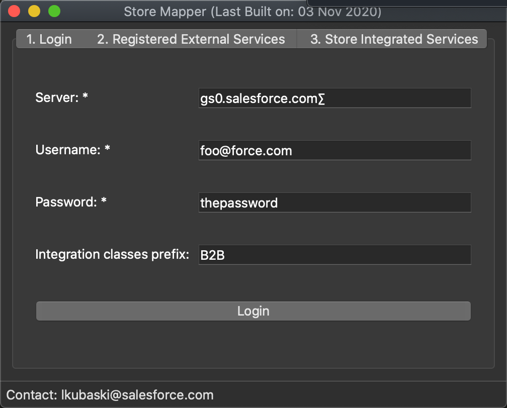
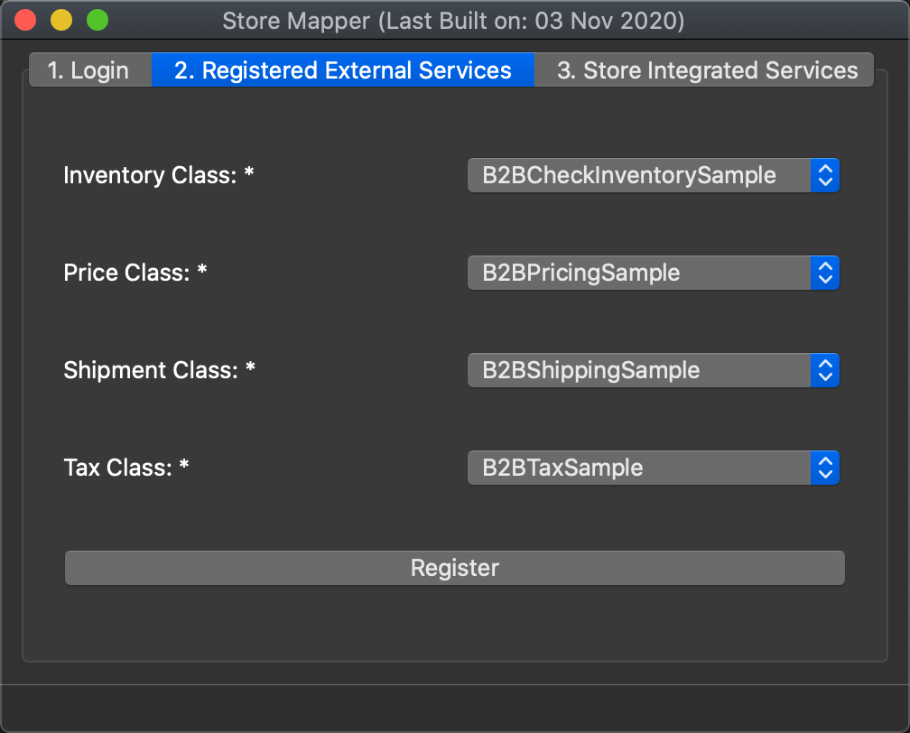
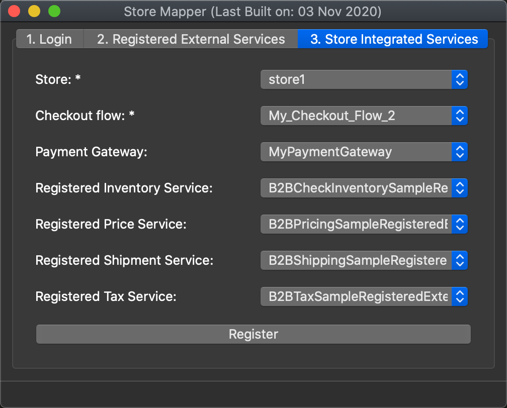

### Description

A tool to create the mapping for a Salesforce Lightning B2B Commerce storefront checkout flow.

### Technology stack
- Language: [Vanilla Javascript](http://vanilla-js.com)
- Frontend: [Nodegui](https://github.com/nodegui/nodegui)
- Backend: [Node.js](https://nodejs.org/en/)

### Screenshots

